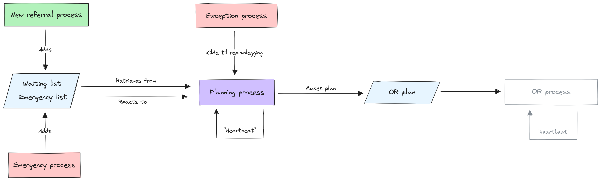

# 🌊 Damona simulator

This is a discrete event simulator for simulating the surgery flow at a hospital.

<picture>
  <source media="(prefers-color-scheme: dark)" srcset="./doc/simulator-diagram-dark.png">
  
</picture>

## 💡 Usage

At the moment only the CLI interface is integrated, you can build and run it
with the `dotnet` tool

```bash
dotnet run --project Damona.Cli -- <scenario> [OPTIONS]
```

It has the following options

```
USAGE:
    Damona.Cli <scenario> [OPTIONS]

ARGUMENTS:
    <scenario>    Path to the scenario file to use for the simulation

OPTIONS:
    -h, --help       Prints help information
    -o, --out        Output path for the simulation summary
    -h, --history    Output path for the simulation history
```

Building the necessary processes and distributions for the simulator is quite
demanding. Some examples of how this could be done, either as data or as code,
is provided in the [examples](Damona.Examples) project. The methods there
served our purpose for the project this was developed for, but it will most
likely need adjustments to be used in other projects.

## ⚙️ Implementation

The project use [SimSharp](https://github.com/heal-research/SimSharp) as the
discrete event simulator framework. In this, the hospitals are modelled as a
set of processes that register new surgeries, and an execution process that
performs these surgeries in operating theatres. In the future we want to expand
this so that there is a planning process that plans the surgeries instead of
them being executed on a first-come-first-served policy. There is also no
resource management yet, and no surgeons, nurses and other staff that needs to
be available for the surgeries to be carried out.

## 👋 About the project

The simulator was developed in an RFF Møre og Romsdal funded project together
with Ålesund Sjukehus and Axbit titled "Simuleringsbasert beslutningsstøtte for
helselogistikk" where we wanted to make decision support for the hospital while
it underwent renovations and had fewer operating theatres than normal. It code
was developed by Aleksandra Glesaaen.

## 📜 License

MIT
